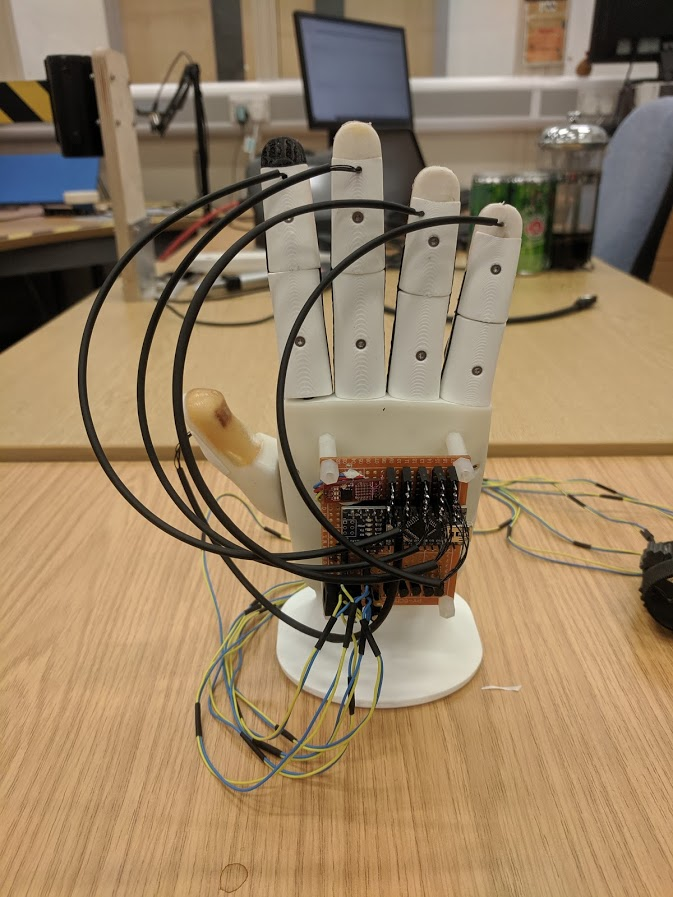
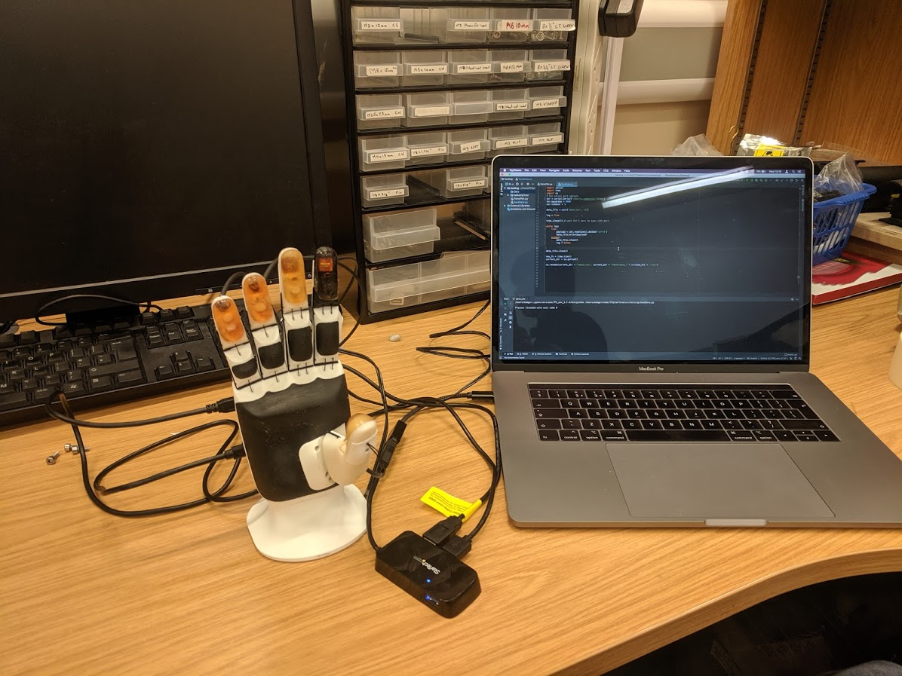
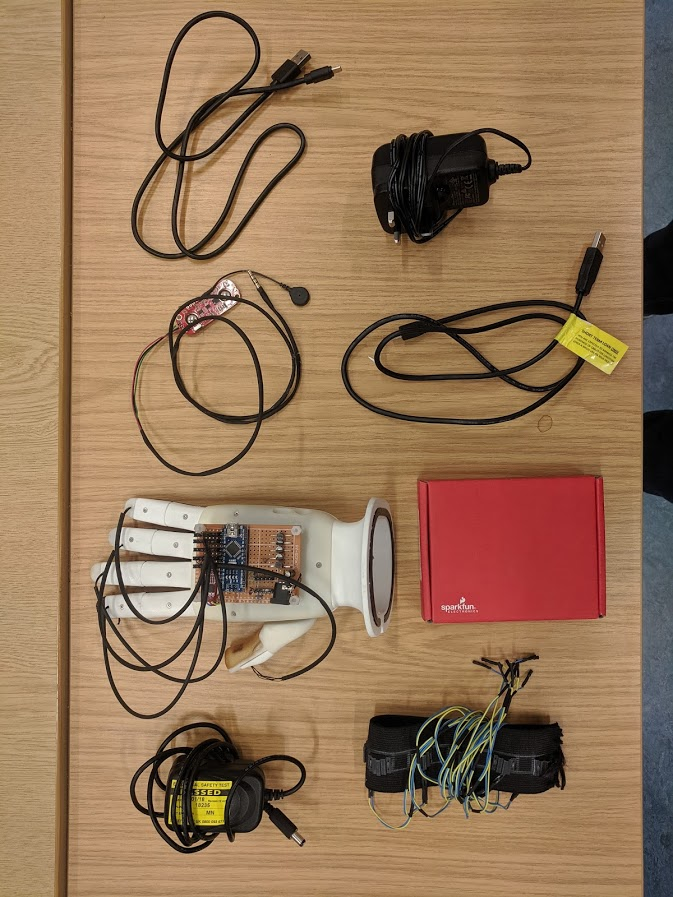
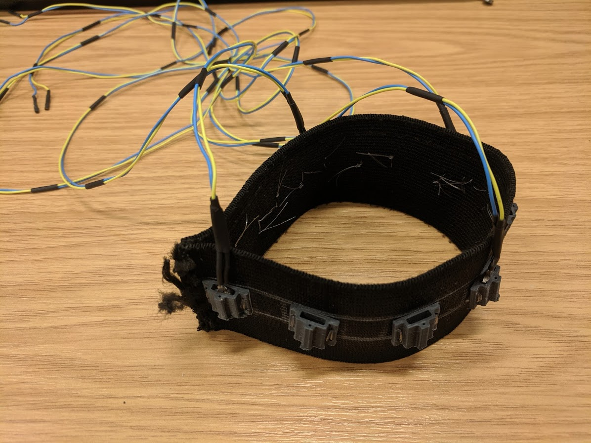

# TFSplatform

The TFS platform is a prosthetic research platform with tactile feedback developed for an MSc in Robotics from the University of Bristol. A report detailing the motivation behind the project along with a description of the build can be found in the report folder. This README overviews the platform then describes how to operate it.

## Platform overview

The TFS platform is based on the Brunel 2.0 developer hand made by Open Bionics. Bought pre-assembled, it was modified to incorporate five (three operational) tactile sensors embedded in the fingertips and thumb. These sensors are sampled by an Arduino Nano which drives a haptic feedback band of vibromotors using a custom controller made on perfboard.

## Operation

The Brunel hand can either be controlled through a myoware sensor or over a Serial connection. Both methods are explained in detail [here](https://openbionicslabs.com/tutorials).

The controller is powered using the 5V 2A PSU which is plugged into the barrel connector in the bottom left of the perfboard. The Arduino is not powered off the 5V bus and needs to be plugged into the host computer using a mini USB cable. Upload the controller code to the Arduino and the controller is good to go. Sensor data can now be viewed using the Arduino IDE Serial Monitor.

Alternatively data can be read and plotted or saved to a CSV using the Python files in the src folder.

Any questions then please send me an email at Tombadger12@gmail.com!

## Photos

